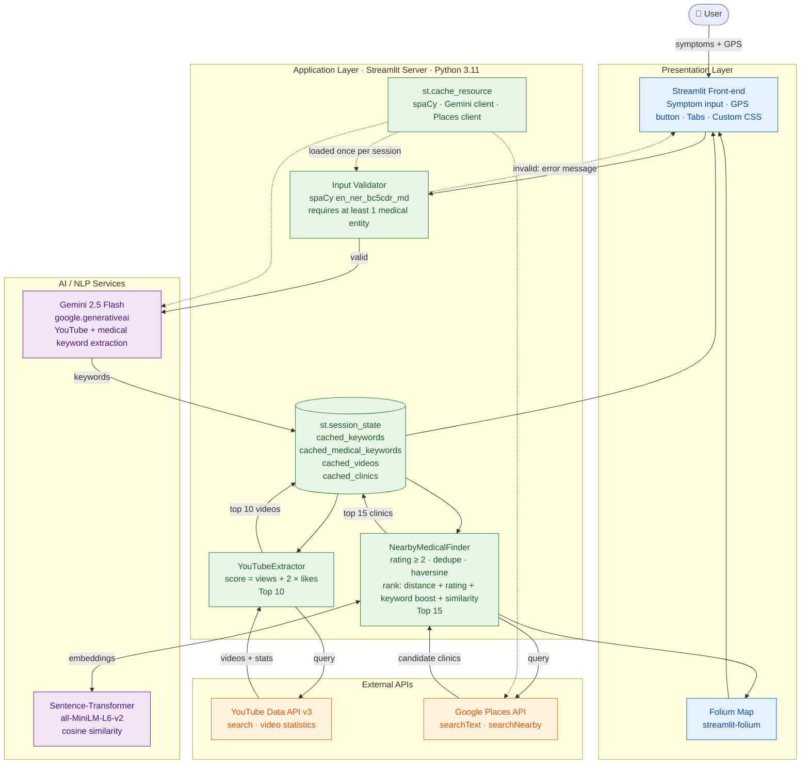

```mermaid
flowchart TB
    User([👤 User])

    subgraph FE["Presentation Layer"]
        UI["Streamlit Front-end<br/>Symptom input · GPS button · Tabs · Custom CSS"]
        MAP["Folium Map<br/>streamlit-folium"]
    end

    subgraph APP["Application Layer · Streamlit Server · Python 3.11"]
        direction TB
        SS[("st.session_state<br/>cached_keywords<br/>cached_medical_keywords<br/>cached_videos<br/>cached_clinics")]
        RES["st.cache_resource<br/>spaCy · Gemini client · Places client"]
        VAL["Input Validator<br/>spaCy en_ner_bc5cdr_md<br/>requires at least 1 medical entity"]
        YTX["YouTubeExtractor<br/>score = views + 2 × likes<br/>Top 10"]
        NMF["NearbyMedicalFinder<br/>rating ≥ 2 · dedupe · haversine<br/>rank: distance + rating + keyword boost + similarity<br/>Top 15"]
    end

    subgraph ML["AI / NLP Services"]
        GEM["Gemini 2.5 Flash<br/>google.generativeai<br/>YouTube + medical keyword extraction"]
        ST["Sentence-Transformer<br/>all-MiniLM-L6-v2<br/>cosine similarity"]
    end

    subgraph EXT["External APIs"]
        YT["YouTube Data API v3<br/>search · video statistics"]
        GP["Google Places API<br/>searchText · searchNearby"]
    end

    User -->|"symptoms + GPS"| UI
    UI --> VAL
    VAL -->|"valid"| GEM
    VAL -.->|"invalid: error message"| UI
    GEM -->|"keywords"| SS
    SS --> YTX
    SS --> NMF
    YTX -->|"query"| YT
    YT -->|"videos + stats"| YTX
    NMF -->|"query"| GP
    GP -->|"candidate clinics"| NMF
    NMF <-->|"embeddings"| ST
    YTX -->|"top 10 videos"| SS
    NMF -->|"top 15 clinics"| SS
    SS --> UI
    NMF --> MAP
    MAP --> UI
    RES -.->|"loaded once per session"| VAL
    RES -.-> GEM
    RES -.-> GP

    classDef ui fill:#E3F2FD,stroke:#1565C0,color:#0D47A1
    classDef app fill:#E8F5E9,stroke:#2E7D32,color:#1B5E20
    classDef ml fill:#F3E5F5,stroke:#6A1B9A,color:#4A148C
    classDef ext fill:#FFF3E0,stroke:#EF6C00,color:#E65100
    class UI,MAP ui
    class SS,RES,VAL,YTX,NMF app
    class GEM,ST ml
    class YT,GP ext
```
