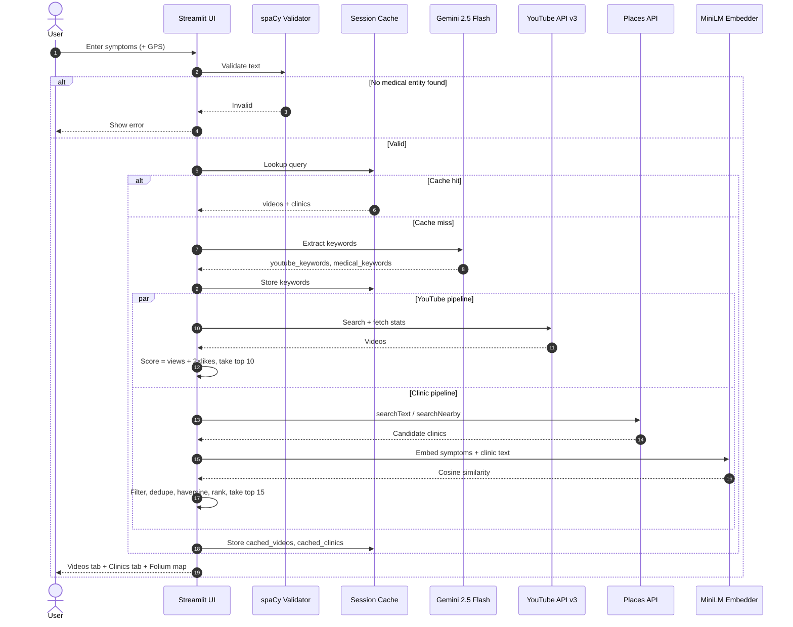

```mermaid
sequenceDiagram
    autonumber
    actor U as User
    participant S as Streamlit UI
    participant V as spaCy Validator
    participant C as Session Cache
    participant G as Gemini 2.5 Flash
    participant Y as YouTube API v3
    participant P as Places API
    participant E as MiniLM Embedder

    U->>S: Enter symptoms (+ GPS)
    S->>V: Validate text
    alt No medical entity found
        V-->>S: Invalid
        S-->>U: Show error
    else Valid
        S->>C: Lookup query
        alt Cache hit
            C-->>S: videos + clinics
        else Cache miss
            S->>G: Extract keywords
            G-->>S: youtube_keywords, medical_keywords
            S->>C: Store keywords
            par YouTube pipeline
                S->>Y: Search + fetch stats
                Y-->>S: Videos
                S->>S: Score = views + 2×likes, take top 10
            and Clinic pipeline
                S->>P: searchText / searchNearby
                P-->>S: Candidate clinics
                S->>E: Embed symptoms + clinic text
                E-->>S: Cosine similarity
                S->>S: Filter, dedupe, haversine, rank, take top 15
            end
            S->>C: Store cached_videos, cached_clinics
        end
        S-->>U: Videos tab + Clinics tab + Folium map
    end
```
